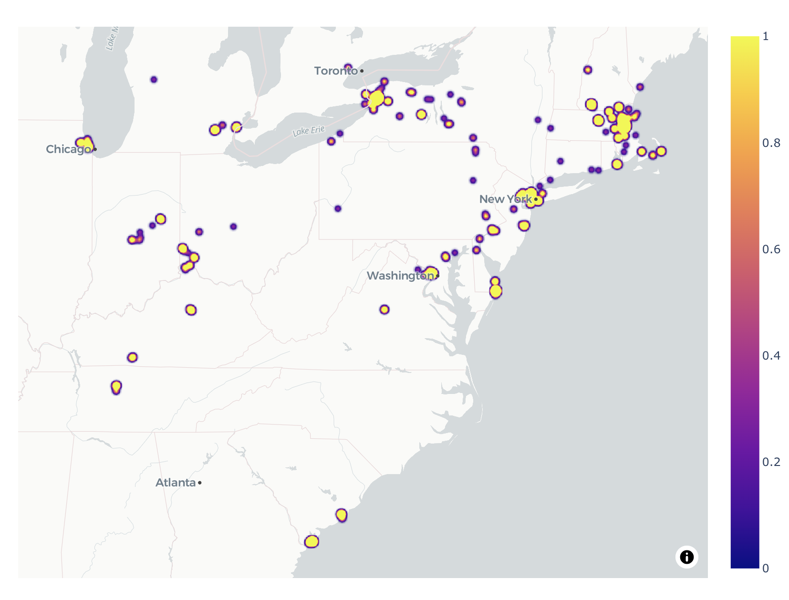
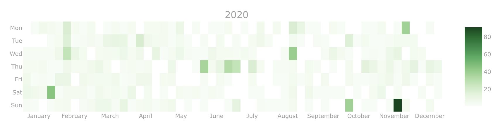
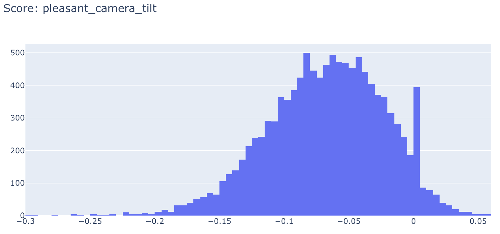
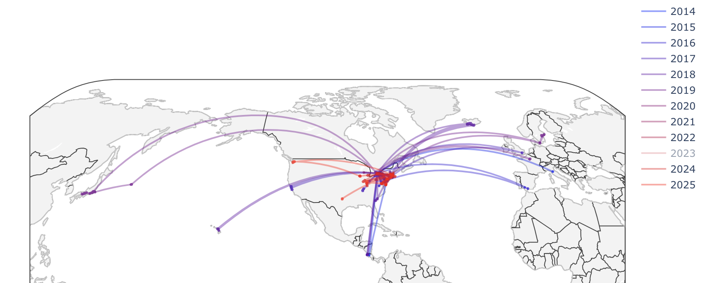

# Apple-Photos-Analysis

Bulk examining the Photos.app library on Mac using [osxphotos](https://github.com/RhetTbull/osxphotos) and [nicegui](https://nicegui.io/), with a central goal to make interesting and useful visualizations.

WIP

## Usage

Check osxphotos repository for up-to-date requirements. Tested only on my Intel Macbook Pro, MacOS 15.5.

> pip install -r requirements.txt

> python main.py

## Screenshots

